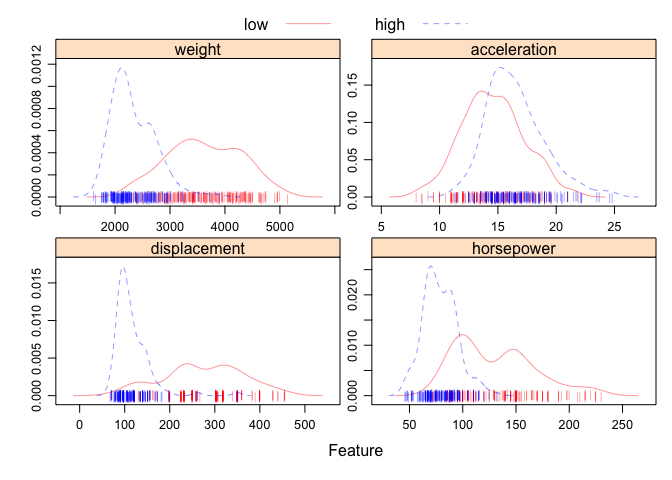
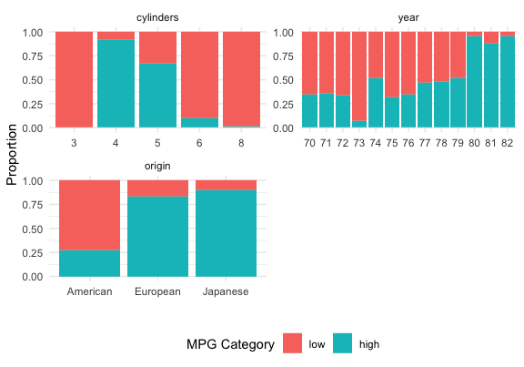
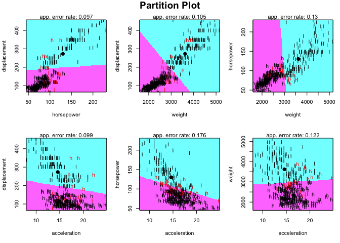
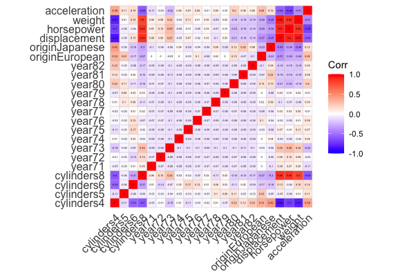

Homework 3 for Data Science II
================
Roxy Zhang
3/22/2022

## Data import and cleaning

``` r
auto = read_csv("auto.csv") %>% 
  janitor::clean_names() %>% 
  mutate(
    mpg_cat = as.factor(mpg_cat),
    mpg_cat = fct_relevel(mpg_cat, "low"),
    cylinders = as.factor(cylinders),
    year = as.factor(year),
    origin = case_when(
      origin == "1" ~ "American",
      origin == "2" ~ "European",
      origin == "3" ~ "Japanese"),
    origin = as.factor(origin)
    )
```

    ## Rows: 392 Columns: 8
    ## ── Column specification ────────────────────────────────────────────────────────
    ## Delimiter: ","
    ## chr (1): mpg_cat
    ## dbl (7): cylinders, displacement, horsepower, weight, acceleration, year, or...
    ## 
    ## ℹ Use `spec()` to retrieve the full column specification for this data.
    ## ℹ Specify the column types or set `show_col_types = FALSE` to quiet this message.

``` r
# reorder columns for future visualization
col_order = c("cylinders", "year", "origin",
               "displacement", "horsepower", "weight", "acceleration", "mpg_cat")
auto = auto[ , col_order]

# check for NA
colSums(is.na(auto))
```

    ##    cylinders         year       origin displacement   horsepower       weight 
    ##            0            0            0            0            0            0 
    ## acceleration      mpg_cat 
    ##            0            0

## Data partition

Split the dataset into two parts: training data (70%) and test data
(30%).

``` r
set.seed(2570)

index_train = createDataPartition(
  y = auto$mpg_cat,
  p = 0.7,
  list = FALSE
)

train = auto[index_train, ]
test = auto[-index_train, ]

head(train)
```

    ## # A tibble: 6 × 8
    ##   cylinders year  origin   displacement horsepower weight acceleration mpg_cat
    ##   <fct>     <fct> <fct>           <dbl>      <dbl>  <dbl>        <dbl> <fct>  
    ## 1 8         70    American          304        150   3433         12   low    
    ## 2 8         70    American          429        198   4341         10   low    
    ## 3 8         70    American          454        220   4354          9   low    
    ## 4 8         70    American          390        190   3850          8.5 low    
    ## 5 8         70    American          383        170   3563         10   low    
    ## 6 8         70    American          340        160   3609          8   low

``` r
# matrix of predictors
# x = model.matrix(mpg_cat~., auto)[ , -1] # remove intercept
# y = test$mpg_cat
```

## Exploratory Data Analysis

Produce some graphical or numerical summaries of the data.

``` r
dim(auto)
```

    ## [1] 392   8

``` r
summary(auto)
```

    ##  cylinders      year          origin     displacement     horsepower   
    ##  3:  4     73     : 40   American:245   Min.   : 68.0   Min.   : 46.0  
    ##  4:199     78     : 36   European: 68   1st Qu.:105.0   1st Qu.: 75.0  
    ##  5:  3     76     : 34   Japanese: 79   Median :151.0   Median : 93.5  
    ##  6: 83     75     : 30                  Mean   :194.4   Mean   :104.5  
    ##  8:103     82     : 30                  3rd Qu.:275.8   3rd Qu.:126.0  
    ##            70     : 29                  Max.   :455.0   Max.   :230.0  
    ##            (Other):193                                                 
    ##      weight      acceleration   mpg_cat   
    ##  Min.   :1613   Min.   : 8.00   low :196  
    ##  1st Qu.:2225   1st Qu.:13.78   high:196  
    ##  Median :2804   Median :15.50             
    ##  Mean   :2978   Mean   :15.54             
    ##  3rd Qu.:3615   3rd Qu.:17.02             
    ##  Max.   :5140   Max.   :24.80             
    ## 

``` r
skimr::skim(auto)
```

|                                                  |      |
|:-------------------------------------------------|:-----|
| Name                                             | auto |
| Number of rows                                   | 392  |
| Number of columns                                | 8    |
| \_\_\_\_\_\_\_\_\_\_\_\_\_\_\_\_\_\_\_\_\_\_\_   |      |
| Column type frequency:                           |      |
| factor                                           | 4    |
| numeric                                          | 4    |
| \_\_\_\_\_\_\_\_\_\_\_\_\_\_\_\_\_\_\_\_\_\_\_\_ |      |
| Group variables                                  | None |

Data summary

**Variable type: factor**

| skim_variable | n_missing | complete_rate | ordered | n_unique | top_counts                     |
|:--------------|----------:|--------------:|:--------|---------:|:-------------------------------|
| cylinders     |         0 |             1 | FALSE   |        5 | 4: 199, 8: 103, 6: 83, 3: 4    |
| year          |         0 |             1 | FALSE   |       13 | 73: 40, 78: 36, 76: 34, 75: 30 |
| origin        |         0 |             1 | FALSE   |        3 | Ame: 245, Jap: 79, Eur: 68     |
| mpg_cat       |         0 |             1 | FALSE   |        2 | low: 196, hig: 196             |

**Variable type: numeric**

| skim_variable | n_missing | complete_rate |    mean |     sd |   p0 |     p25 |    p50 |     p75 |   p100 | hist  |
|:--------------|----------:|--------------:|--------:|-------:|-----:|--------:|-------:|--------:|-------:|:------|
| displacement  |         0 |             1 |  194.41 | 104.64 |   68 |  105.00 |  151.0 |  275.75 |  455.0 | ▇▂▂▃▁ |
| horsepower    |         0 |             1 |  104.47 |  38.49 |   46 |   75.00 |   93.5 |  126.00 |  230.0 | ▆▇▃▁▁ |
| weight        |         0 |             1 | 2977.58 | 849.40 | 1613 | 2225.25 | 2803.5 | 3614.75 | 5140.0 | ▇▇▅▅▂ |
| acceleration  |         0 |             1 |   15.54 |   2.76 |    8 |   13.78 |   15.5 |   17.02 |   24.8 | ▁▆▇▂▁ |

There are 392 rows and 8 columns in the full data, including 4 numeric
predictors: `displacement`, `horsepower`, `weight`, `acceleration`, 3
categorical predictors: `cylinders`, `year`, `origin`, and 1 categorical
response variable: `mpg_cat`.

For better illustration, all EDA plots are done using train data.

``` r
# visualization for numeric variables using feature plot

# set plot theme
theme1 = transparentTheme(trans = .4)
trellis.par.set(theme1)

# density plot
featurePlot(
  x = train %>% dplyr::select(displacement, horsepower, weight,  acceleration), 
  y = train$mpg_cat, 
  scales = list(x = list(relation = "free"),
                y = list(relation = "free")),
  plot = "density",
  pch = "|",
  auto.key = list(columns = 2))
```

<!-- -->

The feature plot shows that higher MPG category is associated with lower
weight, higher acceleration, lower displacement and lower horsepower.

``` r
# visualization for categorical variables using ggplot

train %>% 
  dplyr::select(-displacement, -horsepower, -weight, -acceleration) %>% 
  melt(id.vars = "mpg_cat") %>% 
  ggplot(aes(x = value, fill = mpg_cat)) + 
  geom_bar(position = "fill") + 
  #scale_y_continuous(labels = scales::percent) + # % on y axis
  labs(x = "",
       y = "Proportion",
       fill = "MPG Category", # legend title
       color = "MPG Category") +
  facet_wrap(~variable, scales = "free", nrow = 2)
```

    ## Warning: attributes are not identical across measure variables; they will be
    ## dropped

<!-- -->

This plot shows that higher MPG category mainly lies in cars with 5 or 6
cylinders, model year 1908s, and origin of European and Japanese.

``` r
# LAD partition plot for numeric variables
partimat(
  mpg_cat ~ displacement + horsepower + weight + acceleration,
  data = auto,
  subset = index_train,
  method = "lda")
```

<!-- -->

The LDA partition plot is based on every combination of two numeric
variables, which gives the decision boundrary of making
classification.  
Red labels are misclassified data.  
Although in LDA we use all the predictors rather than just the
combination of two predictors, this plot shows some potential patterns
of the data (since we cannot visualize things easily in high-dimensional
space).

``` r
# correlation plot for all data
model.matrix(mpg_cat~., data = train)[ , -1] %>% 
  cor(use = "pairwise.complete.obs") %>% 
  ggcorrplot(type = "full", lab = TRUE, lab_size = 1)
```

<!-- -->

We can see from the correlation plot that the numeric predictors
`displacement`, `horsepower`, `weight`, `acceleration` are highly
correlated, which may potentially result in some redundancy for model
building.  
Also, `cylinders8` is highly correlated with above numeric predictors.

## Logistic Regression
